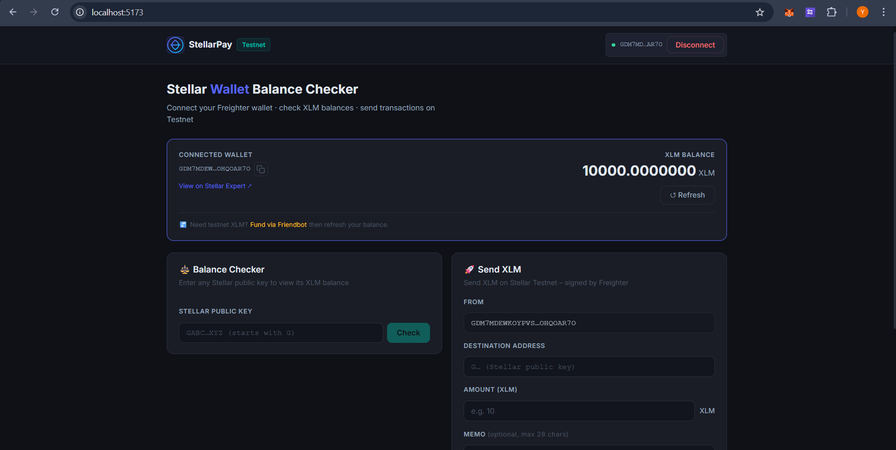
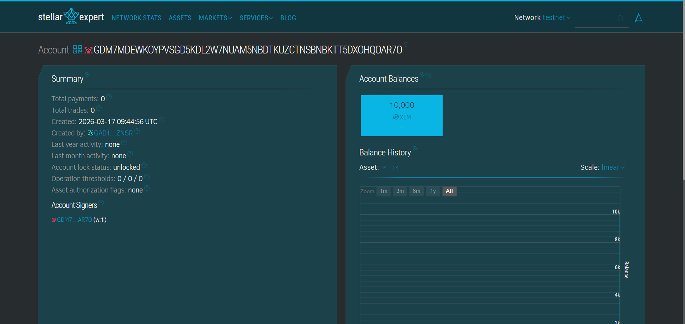

# Stellar Wallet (Freighter)

A small React demo that connects to a Freighter wallet and shows account balance plus recent transaction history (Testnet).

## 🚀 Quick start


Prerequisites:
- Node.js (recommended v16+)
- Freighter browser extension (enabled and set to **Testnet**)

Install and run:

```bash
npm install
npm start
```

The dev server runs over HTTPS by default: `https://localhost:3000`.

---

## ✨ Features

- Connect with Freighter and display connected public key
- Show XLM balance for the connected account
- Transaction History Viewer — fetches recent operations from Horizon (Testnet)
- Links to view transactions on StellarExpert (Testnet)
- Helpers for signing transactions via Freighter available in `src/components/Freighter.js`

---

## 📁 Key files

- `src/components/Freighter.js` — Freighter helpers + Horizon Server (Testnet)
- `src/components/Header.js` — connect button, shows balance and mounts `TransactionHistory`
- `src/components/TransactionHistory.js` — fetch & render recent operations

---

## � Screenshots

### Wallet connected state



Header shows truncated public key and a green Connected state.

### Successful testnet transaction



Example of a submitted transaction recorded on Testnet.

---
## �🛠 Development notes

- Change how many operations display by editing the `limit` prop passed to `<TransactionHistory />` in `Header.js`.
- To switch to the public Stellar network, change the Horizon server in `src/components/Freighter.js` to `https://horizon.stellar.org` and update any network passphrase usage.

Example:

```js
// src/components/Freighter.js
const server = new StellarSdk.Horizon.Server('https://horizon.stellar.org');
```

---

## ✅ Tests & build

- Run tests: `npm test`
- Create production build: `npm run build`

---

## 🔒 Notes

- This app uses the Testnet Horizon endpoint by default.
- Freighter manages private keys and signing in the browser — the app never stores private keys.

---

## 🤝 Contributing

Contributions welcome. Open issues or PRs for features like pagination, memo decoding, or moving wallet state to React Context.

---

## 📄 License

Add a `LICENSE` file if you plan to publish under a specific license.

---

If you'd like, I can add pagination (`Load more`), decode memos in the history list, or lift wallet state into a global context — which should I implement next?
